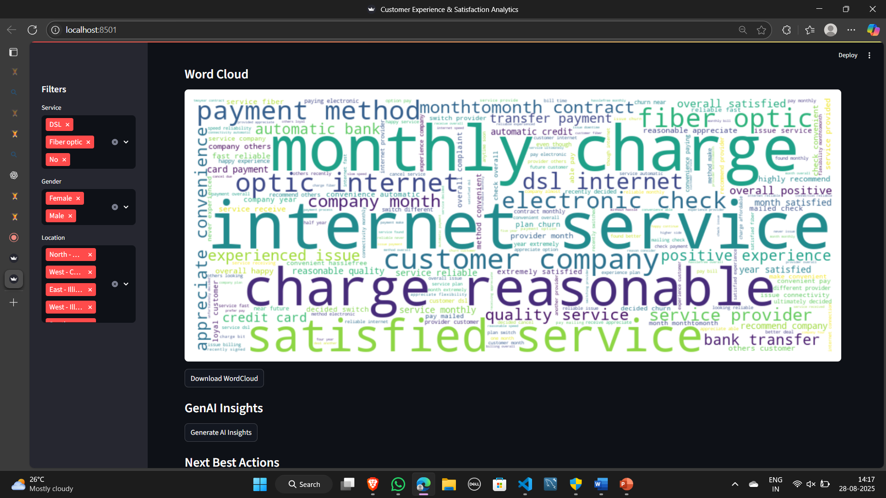

# Customer Experience & Satisfaction Analytics Dashboard

📊 **Advanced NLP • Sentiment & Topic Modeling • GenAI Summaries • Hackathon-ready Dashboard**

---

## Overview

This project is a **Streamlit web application** that analyzes customer feedback data to provide:  
- Sentiment analysis (Positive, Negative, Neutral)  
- Topic modeling using LDA  
- GenAI summaries and actionable next-best-actions  
- Multi-format export: TXT, Excel, Word, PDF  
- Interactive filters by service, gender, location, and date  

It’s designed for **business intelligence, CX analysis, and hackathon submissions**.

---

## Features

1. **Dashboard & KPIs**  
   - Total feedback count  
   - Positive/Negative percentage  
   - Average sentiment score  

2. **Visual Insights**  
   - Sentiment distribution pie chart  
   - Sentiment by service histogram  
   - Sentiment trend over time  
   - Topic volume and sentiment  
   - Word cloud of cleaned feedback  

3. **GenAI Insights**  
   - Summarizes feedback into Positives, Complaints, Recommendations  
   - Suggests actionable next-best-actions  

4. **Report Export**  
   - Downloadable in **TXT, Excel, Word, PDF**  
   - Includes charts and topic insights  

5. **Interactive Filters**  
   - Filter feedback by **Service, Gender, Location, Date**  

---

## Screenshots

Below are example screenshots of the dashboard. Replace the placeholders with your actual images from the `screenshots/` folder.

  
*Dashboard overview with KPIs and filters*

  
*Pie chart showing sentiment distribution*

  
*Top topics identified via LDA*

  
*Word cloud generated from feedback text*

  
*Multi-format report export options*

> 💡 To add screenshots: create a folder in your repo called `screenshots/` and upload your images there.

---

## Installation

1. Clone the repository:

```bash
git clone https://github.com/Mohammedsabeel063/customer_experience_satisfaction_analytics.git
cd customer_experience_satisfaction_analytics
